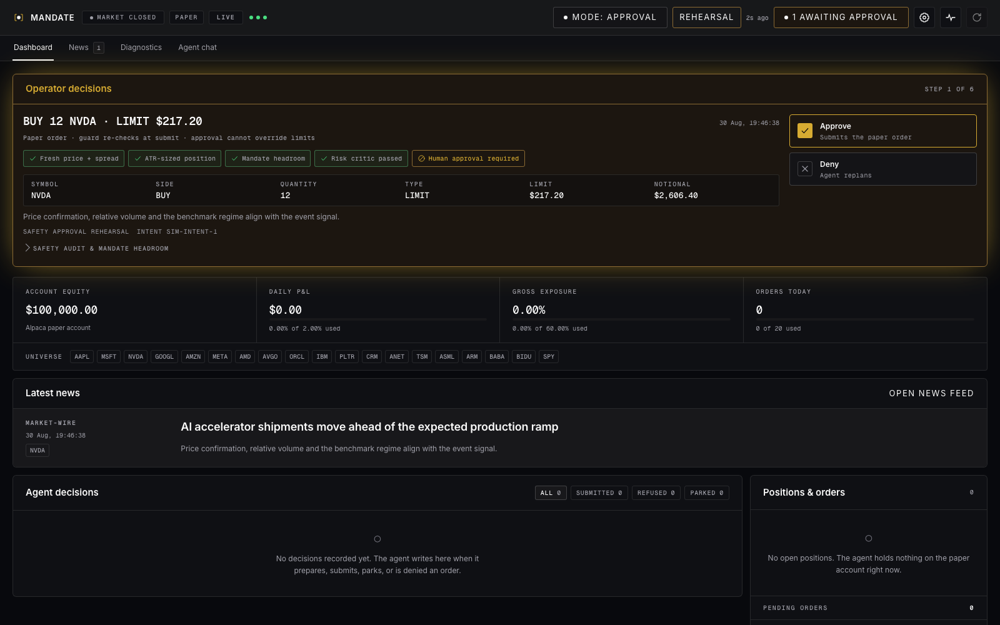
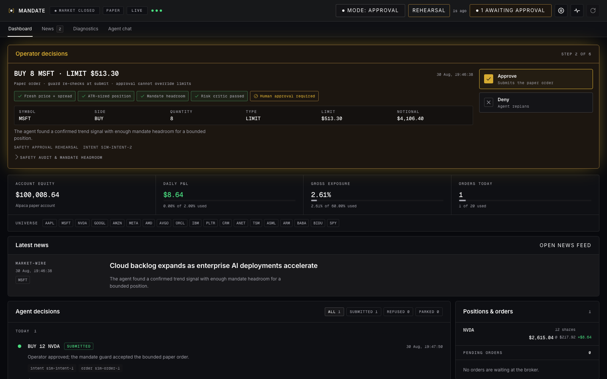
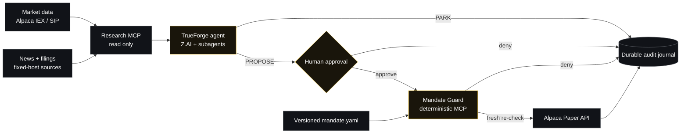

<div align="center">
  

# MANDATE

### An autonomous paper-trading agent with authority you can prove

**The model proposes. Deterministic code constrains. A human authorizes.**

[](https://www.truefoundry.com/trueforge)
[](https://alpaca.markets/)
[](https://www.python.org/)
[](https://www.typescriptlang.org/)
[](https://modelcontextprotocol.io/)

[**Open live demo →**](https://harn.miposts.com) · [Architecture](#architecture) · [Run locally](#run-locally) · [Safety evidence](#verified-safety-evidence)

</div>

> [!NOTE]
> **Public test profile** — URL: **[harn.miposts.com](https://harn.miposts.com)** · Login: `demo` · Password: `MandateDemo2026`
>
> This shared profile is an isolated, interactive safety rehearsal. It exposes no production account values, internal service URLs, secrets, or trajectory controls. It can respond only to the bounded rehearsal approvals shown in the UI.



## Why MANDATE exists

Giving an LLM a broker API creates an authority problem, not merely a prediction problem. A persuasive model response is not proof that an order respects position limits, current exposure, market hours, loss budgets, or the operator's intent.

MANDATE separates intelligence from authority:

| The usual agent risk | MANDATE's answer |
|---|---|
| The model can reach a raw trading endpoint | The model receives no raw order-placement tool |
| Natural-language rules are interpreted loosely | A strict, versioned YAML mandate is executable policy |
| Approval can accidentally override risk controls | Approval resumes execution but never bypasses the guard |
| Stale data produces confident actions | Freshness, spread, volume, session and benchmark gates fail closed |
| Retries can duplicate an order | Stable intent IDs and broker provenance make retries idempotent |
| A dashboard can display stale broker state as live | Degraded mode withholds unverifiable values visibly |

The result is a 24/7 research agent that can monitor markets, explain opportunities, ask for approval, and submit **paper orders only when deterministic code proves they are inside the mandate**.

## Product experience

### One decision at a time

The operator sees a compact decision card, ready position size, order terms, rationale, and the exact safety checks that passed. Approve or deny; the completed card moves into the journal instead of taking over the screen.

### A live, legible portfolio

Equity, P&L, exposure, positions, orders, news, agent decisions and mandate headroom update on one full-width dashboard. News has a focused latest-story view and a separate feed; monitoring controls live in an IDE-style settings drawer.



### Chat as the control plane

The agent keeps working outside chat. Chat remains available to explain a decision, inspect evidence, adjust the thesis, narrow the symbol pool, or propose a cadence/risk-posture change. Persistent trajectory changes require explicit confirmation and cannot expand the hard mandate universe.

## Architecture



There are three deliberately unequal trust zones:

1. **Research plane — unprivileged.** Parses bounded market/news inputs, calculates features and produces evidence. It has no trading client.
2. **Agent plane — creative but untrusted.** TrueForge and the model can research, challenge a thesis and propose an action. Tool allowlists prevent direct execution.
3. **Execution plane — deterministic.** The guard owns paper broker credentials, reloads the human mandate, fetches fresh state, applies every limit with `Decimal`, and journals the result.

## What the agent understands

The production funnel monitors 18 liquid AI/platform/infrastructure equities plus SPY:

`AAPL` `MSFT` `NVDA` `GOOGL` `AMZN` `META` `AMD` `AVGO` `ORCL` `IBM` `PLTR` `CRM` `ANET` `TSM` `ASML` `ARM` `BABA` `BIDU` `SPY`

It turns price, liquidity, market regime and attributable news into eight explainable strategy outputs:

- price momentum and volatility-adjusted momentum;
- rolling z-score and RSI mean reversion;
- volume-confirmed breakout;
- MACD trend;
- structured LLM news impact confirmed by price;
- regime-weighted ensemble.

News is scored as structured data — `sentiment`, `confidence`, `event_type`, `horizon`, `novelty_vs_48h`, affected tickers and reason — rather than by a tiny positive/negative word list. The LLM enriches evidence; deterministic code still owns the decision boundary.

ATR14 sizing converts risk budget and signal strength into a whole-share quantity, capped by mandate headroom and same-side correlation clusters. SPY trend/range state changes ensemble weights and scales gross risk. Completed 5/15/60-minute outcomes update bounded strategy multipliers, including counterfactual outcomes for parked ideas: adaptive behavior without letting a model rewrite policy.

## Safety invariants

| Invariant | Enforcement |
|---|---|
| **Paper only** | Exact host allowlist accepts `https://paper-api.alpaca.markets`; live, HTTP, credential-bearing and look-alike URLs are rejected |
| **No hidden authority** | The agent cannot write the mandate and cannot access a direct broker execution tool |
| **Fresh-state validation** | Account, broker clock, latest trade, pending orders and every limit are re-read immediately before submit |
| **Fail closed** | Missing/malformed policy, transport errors, stale data, closed sessions and unknown rules deny execution |
| **Approval is not an override** | Human approval resumes the tool call; the guard repeats policy checks independently |
| **Bounded risk** | Position, gross exposure, daily loss, order count, session, universe, instrument and order type are deterministic |
| **Safe retries** | Canonical intent fingerprints, stable client IDs and durable provenance prevent duplicate or mutated retries |
| **Auditable changes** | Every prepared, denied and submitted event carries the SHA-256 fingerprint of the validated mandate |
| **Protected exits** | Cancellation requires submitted provenance; closes are risk-reducing and explicitly opt-in |
| **Untrusted news** | Input is size-bounded, normalized, timestamped and treated only as data—not as instructions |

The guard supports human-authored predecisions such as `daily_loss_pct >= 1 → park_new_orders`. Unknown metrics or actions make the mandate invalid instead of being guessed.

## TrueForge: the agent harness

TrueForge provides the durable agent runtime around the safety kernel:

- persistent sessions, tool-call traces and context compaction;
- MCP tool isolation and explicit execution allowlists;
- approval pauses for irreversible actions;
- dynamic read-only subagents for price research, news research and risk challenge;
- sandbox access for bounded experiments, watched by a persisted-event policy auditor;
- one operator workspace for autonomous runs and conversational control.

The background runner consumes Alpaca news and market WebSockets with a configurable REST fallback. Every cycle must end in `ACTION: PARK` or `ACTION: PROPOSE`; a mechanical post-model gate parks any proposal that violates session, liquidity, staleness, relative-volume, macro or mandate constraints.

## Example mandate

Human authority is small enough to read and strict enough to execute:

```yaml
universe: [AAPL, MSFT, NVDA, GOOGL, AMZN, META, AMD, AVGO, SPY]
instruments: [equity]
order_types: [limit]
session: regular_hours_only
limits:
  max_position_pct: 10
  max_gross_exposure_pct: 60
  max_daily_loss_pct: 2
  max_orders_per_day: 20
predecided:
  - when: daily_loss_pct >= 1
    then: park_new_orders
    reason: Protect the remaining daily loss budget before the hard stop.
allow_short_positions: false
allow_risk_reducing_market_close: true
expires: 2099-08-28T20:00:00Z
```

See the complete [example mandate](mandate/mandates/example.yaml).

## Run locally

### Prerequisites

- Python 3.11+
- Node.js 22 or 24
- Alpaca **paper** account
- Z.AI API key for structured news scoring

Copy the environment template and add local secrets. Never commit `.env`:

```bash
cp mandate/.env.example mandate/.env
```

Install and test the deterministic services:

```bash
cd mandate/mcp-guard
python -m venv .venv
source .venv/bin/activate
python -m pip install -e '.[test]'
python -m pytest

cd ../../mandate/research
python -m pip install -e '.[test]'
python -m pytest
```

Build the dashboard and validate the agent:

```bash
cd mandate/app
npm install
npm run typecheck
npm run build

cd ../agent
npm install
npm run typecheck
npm run eval:autonomy
```

Start the guard, research MCP, dashboard, TrueForge and autonomy runner as separate supervised processes:

```bash
mandate-guard
MANDATE_RESEARCH_TRANSPORT=streamable-http mandate-research-mcp
mandate-dashboard

cd mandate/agent
npm run apply
npm run autonomy
```

The default local ports are guard `8010`, research `8020`, dashboard API `8030`, and TrueForge/UI `8790`. Deployment should keep MCP and dashboard services on loopback and expose only the authenticated HTTPS operator UI.

## Verified safety evidence

The repository contains executable probes, not just architecture claims:

| Probe | What it proves |
|---|---|
| `npm run eval:sandbox` | Deterministic Code Mode works without touching MCP or approval |
| `npm run eval:subagents` | Two isolated read-only subagents delegate without execution authority |
| `npm run eval:approval` | An irreversible tool pauses; denial leaves the guard journal byte-identical |
| `npm run eval:research-e2e` | TrueForge + Z.AI use bounded research tools and produce no broker write |
| `MANDATE_E2E_ALLOW=true npm run eval:paper-e2e` | Supervised paper submit, durable provenance and idempotent retry |
| `npm run eval:cancel-e2e` | Exact-ID cancellation requires submitted guard provenance |

The sanitized [paper E2E artifact](docs/evidence/paper-e2e-2026-08-27.json) records a real Alpaca paper flow: `prepared → submitted`, official broker readback, an unchanged retry producing `deduplicated`, and an approval-gated cancellation. The [verification report](docs/MANDATE_VERIFICATION.md) documents the wider integration evidence.

> [!IMPORTANT]
> Backtests use point-in-time inputs, configurable fees, spread-crossing slippage and a frozen-parameter holdout. Their output is engineering evidence—not a profitability claim or forecast.

## Qodo review discipline

Qodo Code Review was installed before the first product code. Milestones M1–M12 were reviewed through PRs [#1](https://github.com/GoatWhistle/harness-hack/pull/1) and [#2](https://github.com/GoatWhistle/harness-hack/pull/2). Findings included pending-exposure undercounting, concurrent submissions, mandate bypass on close, retry provenance and point-in-time news errors; each was fixed with a regression test. Recorded repeat reviews report **0 bugs and 0 rule violations** for the reviewed milestone commits.

The full, commit-linked history and project-specific review rules are in the [Qodo review log](docs/QODO_REVIEW_LOG.md). New commits are not represented as Qodo-reviewed until their review is added to that log.

## Repository map

```text
mandate/
├── agent/          # TrueForge spec, 24/7 runner and executable E2E probes
├── app/            # React operator dashboard and agent workspace
├── mandates/       # Human-owned, versioned authority
├── mcp-guard/      # Deterministic execution boundary and audit journal
└── research/       # Read-only signals, news, monitoring, sizing and backtests
docs/
├── assets/         # Product screenshots
├── evidence/       # Sanitized machine-readable E2E artifacts
├── MANDATE_VERIFICATION.md
└── QODO_REVIEW_LOG.md
```

## Scope and disclaimer

MANDATE is a safety-focused hackathon project for **paper trading only**. It does not place live-money orders, provide investment advice, promise profit, or imply that backtest/paper performance will transfer to live markets. Production use would require independent security review, regulatory analysis, operational controls and extensive validation beyond this repository.

<div align="center">

**Built to make agent authority visible, bounded and auditable.**

[Try the safety rehearsal](https://harn.miposts.com) · [Read the verification report](docs/MANDATE_VERIFICATION.md) · [Inspect the Qodo log](docs/QODO_REVIEW_LOG.md)

</div>
