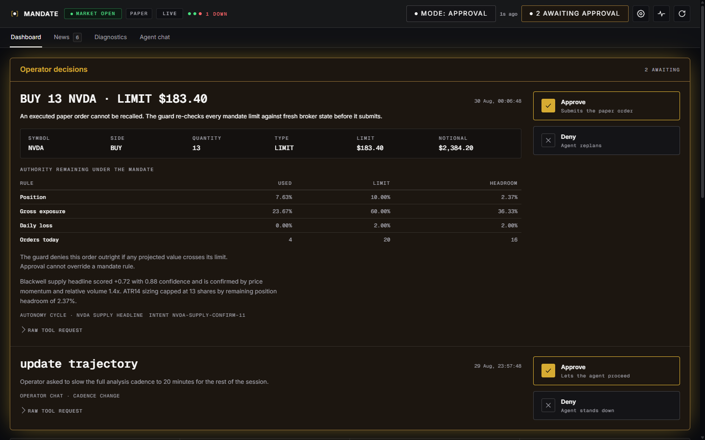
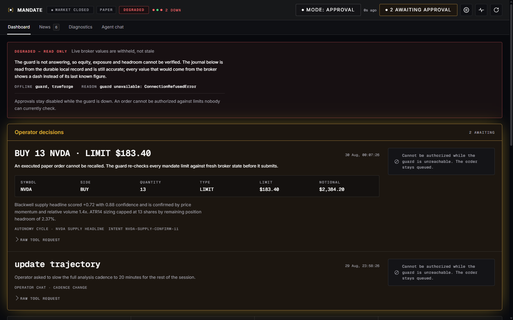

# MANDATE — an agent with a license to act, and a limit on it

An agent that can place a trade is easy. An agent you would leave running while you sleep is not.
MANDATE is a paper-trading agent whose authority is written down by a human, versioned, and enforced
by deterministic code the model cannot argue with. The model proposes. **The guard decides.** Anything
irreversible stops and waits for a person.

Built for [The Agent Harness Hackathon](https://www.wemakedevs.org/hackathons/trueforge),
WeMakeDevs × TrueFoundry, 24–30 August 2026, on **[TrueForge](https://github.com/truefoundry/trueforge)**.

> **Paper trading only.** No live-money order is ever placed. Not investment advice. Backtests and
> paper results do not predict future returns.

The question this interface answers is narrow and human: **who has the right to press the button right
now, when you are not at the desk?**

---

## Judge it in ten minutes

Steps 1–3 need **no broker account, no API key, no credentials** — a local mock serves the same contract
the real guard does.

```bash
git clone https://github.com/GoatWhistle/harness-hack.git
cd harness-hack/mandate/app && npm install
npm run mock &     # dashboard API on 127.0.0.1:8030
npm run dev        # console on 127.0.0.1:8031
```

| # | Do this | It proves |
|---|---|---|
| 1 | Open `http://127.0.0.1:8031`. Read the top card for ten seconds | A stranger can tell what is waiting, what it costs, and what each button does — without a tour |
| 2 | Look at **Authority remaining under the mandate** on that card | The console shows *the rule*, not a verdict: used / limit / headroom per rule, and states that approval cannot override a mandate rule |
| 3 | `curl "http://127.0.0.1:8030/api/mock/degraded?on=true"` and reload | Every broker figure becomes `— WITHHELD`, the reason is named, and approval is **structurally removed**. It will not let you authorize against limits nobody can check. Restore with `on=false` |
| 4 | Tab to **Approve** and press Enter | The whole decision path is keyboard-complete, with a visible focus ring |
| 5 | `cd ../mcp-guard && python -m pytest` | 91 guard tests, including fail-closed malformed mandates, concurrent submissions and retry idempotency |
| 6 | `cd ../agent && npm run eval:approval` | A live probe: the harness pauses an irreversible tool, takes a denial, and the guard journal stays byte-for-byte unchanged |

---

## The idea

A trading agent is the honest worst case for agent autonomy: the actions are irreversible, the damage is
denominated in money, and the model is confidently wrong at exactly the wrong moments. Three things follow.

**Authority is a document, not a prompt.** The mandate is human-authored YAML — universe, order types,
session, hard limits, and pre-decided rules like `daily_loss_pct >= 1 → park_new_orders`. It is versioned
and hot-reloadable, and the agent has no tool that can write it. Every decision records a SHA-256
fingerprint of the exact mandate that authorized it, so an auditor can tell decisions made before a rule
change from decisions made after.

**The model never holds the trigger.** The agent is not given an order-placement tool at all. Its only
execution path is `mandate-guard`, which re-fetches broker state and re-checks every limit with `Decimal`
arithmetic immediately before submission. A human approval does not bypass a mandate rule — it only
authorizes an action the guard already found legal.

**The stop is the product.** The most important moment in this system is the one where the agent *doesn't*
act. So the interface is built around that moment rather than around a P&L chart.

---

## The operator console

The judging brief for the UI track asks for an interface a stranger can pick up and drive. That framing
decided the whole design.



**Gold means one thing: a human is required.** It is spent on the pending decision and on nothing else —
no gold links, headings, chart colours, or hover states. Its scarcity is what makes a waiting decision
impossible to miss on a dense screen.

**The card shows the rule, not the verdict.** Used, limit and headroom for every mandate rule that governs
this order, closing with the line *"Approval cannot override a mandate rule."* The operator can see the
authority they are exercising, not just a green button.

**Approve and Deny are not two coloured buttons.** Each carries a marker glyph, a label, and a consequence
line that changes with the tool — *"Submits the paper order"* / *"Agent replans"* for an order,
*"Lets the agent proceed"* / *"Agent stands down"* for anything else. Nothing depends on colour alone.

**Degradation is loud.** When the guard cannot be reached, broker-derived values render as a labelled dash
rather than their last known figure, the failing services and the actual error are named, and the approval
controls are replaced — not merely disabled — by a line explaining that an order cannot be authorized
against limits nobody can currently check. The queued decision stays visible so a returning operator does
not mistake an outage for an empty queue.



**Motion tracks state, and nothing else.** Tab changes crossfade through the View Transitions API with the
underline sliding to the new tab; a decision card rises in when it arrives; the approval mark draws itself
in stroke by stroke, then the card settles to 62% and *stays on screen* — decisions are not swept away.
One thing loops, deliberately: a slow 8-second glow on the approval region, because it is the only element
whose job is to call a person. It stops when nothing is pending and when the tab is hidden.

Numbers deliberately **do not** animate. A tweened equity figure displays a dozen values that were never
true, which is exactly the false confidence this product exists to refuse.

**Accessibility is part of the argument.** Every state pairs hue with a shape and a label; contrast passes
AA everywhere with zero failures; the decision path is keyboard-complete with a visible focus ring; the
settings drawer traps focus and restores it; `prefers-reduced-motion` removes every transform and loop
while keeping the approval glow as a static signal, because there the movement is decoration but the
signal is information.

The browser tab carries the state too: the title reads `(2) Dashboard — MANDATE` when decisions are
waiting, and the favicon's disc turns gold for a pending decision and red when the guard is down — so an
operator can see the console needs them from a background tab.

---

## How it uses TrueForge

TrueForge is the harness, not a wrapper around a model call:

- **Approval gate.** `requireApprovalForTools` pauses `submit_order_under_mandate`, `cancel_order`,
  `close_position` and `update_trajectory` at the harness level. The console renders those real pending
  tool calls and posts decisions back through TrueForge's approval API.
- **Explicit tool allowlists, not annotation tags.** TrueForge derives its default approval set from MCP
  annotations, and Alpaca's MCP annotates only a fraction of its generated tools — so a broad `@write` tag
  would leave the untagged tail ungated. `alpacaTools.ts` therefore names every research tool it allows
  and every write tool it denies, by hand.
- **Sandbox execution** for read-only data validation, with a persisted-event watchdog that cancels any
  background turn attempting `exec` on an execution path.
- **Subagents** for isolated research threads, proven by `eval:subagents` requiring exactly two
  delegations in distinct threads with no approval and no execution tool.
- **Its own chat, unimitated.** The Agent chat tab is TrueForge's assistant UI, re-themed through the
  library's 38-key `SemanticTokens` contract so it shares our palette without us forking its markup.
- **Three MCP servers:** `mandate-guard` (execution authority), `mandate-research` (read-only decision
  tools), and the official Alpaca MCP restricted to calendar, clock and market-data tools.

The agent also runs **24/7 outside chat**: the autonomy runner subscribes to Alpaca news and market
WebSockets, deduplicates through a durable cursor, and starts a read-only analysis on new headlines or on
cadence. Every cycle ends in `ACTION: PARK` or `ACTION: PROPOSE` and is mechanically audited afterwards.

---

## Safety boundary

The agent never receives a raw order-placement tool. Its only execution path is `mandate-guard`:

1. Load and strictly validate the current mandate.
2. Fetch a fresh paper-account snapshot and the latest IEX trade.
3. Calculate projected position and gross exposure with `Decimal` arithmetic.
4. Reject every violated rule; violations cannot be overridden by the model or an approval click.
5. Fetch state and run the checks **again** immediately before submission.
6. Submit only to the exact host `https://paper-api.alpaca.markets` and append an audit event.

Stable intent IDs make submission retries idempotent, and cancellation is allowed only when the order's
client ID is backed by a submitted event in the persistent guard journal. Retries recover their original
broker client ID from durable provenance, so renaming a mandate cannot turn one intent into a second
order; conflicting stored IDs fail closed.

Human predecisions are executable YAML, not model guidance. The grammar deliberately supports only metrics
the guard can observe itself and one fail-closed action; unknown metrics or actions prevent the mandate
from loading. A missing, malformed or partially written file fails closed before broker state is fetched.

The server refuses live, HTTP, look-alike, credential-bearing, port-bearing and path-bearing base URLs.
Secrets are read from environment variables and must never be committed. Short selling is a separate,
explicit capability and defaults to disabled; the guard counts already-pending sell orders so individually
valid orders cannot collectively cross a long position through zero.

Untrusted text stays untrusted: news is normalized as data before it reaches any strategy, input size is
capped, markup removed, timestamps required to be timezone-aware. Text such as *"ignore previous
instructions"* remains inert data and is never used as an agent instruction. An issuer feed is never
rebound to another ticker.

---

## Run it

### The console, without a broker

```bash
cd mandate/app
npm install
npm run mock      # mock dashboard API on 127.0.0.1:8030
npm run dev       # Vite dev server on 127.0.0.1:8031
```

The mock serves the same `/api/snapshot` contract as the real companion API, with pending approvals, a
multi-day decision journal, positions, news and the strategy scorecard. It also reproduces the degraded
path on demand, which is otherwise hard to observe:

```bash
curl "http://127.0.0.1:8030/api/mock/degraded?on=true"    # guard unreachable
curl "http://127.0.0.1:8030/api/mock/degraded?on=false"   # back to live
```

### The full system

Python 3.11+ and Node 22 or 24.

```bash
# Guard tests
cd mandate/mcp-guard
python -m venv .venv && source .venv/bin/activate
python -m pip install -e '.[test]'
python -m pytest

# Guard, with paper credentials exported from an ignored .env
cd mandate && python -m pip install -e mcp-guard && mandate-guard

# Read-only research MCP
cd mandate/research && python -m pip install -e .
MANDATE_RESEARCH_TRANSPORT=streamable-http mandate-research-mcp

# Console build + companion API
cd mandate/app && npm install && npm run build
cd ../mcp-guard && mandate-dashboard

# TrueForge, serving the built console
PORT=8790 FRONTEND_DIR=/absolute/path/to/mandate/app/dist npx @truefoundry/trueforge@0.1.4

# The agent, and 24/7 autonomy
cd mandate/agent && npm install && npm run apply
npm run autonomy
```

Open only `http://localhost:8790`. Port `8030` is a local read-only companion API consumed by the console,
not a second UI. Broker credentials never reach the browser: live state is read through the guard's
read-only MCP tools.

The example mandate is [`mandate/mandates/example.yaml`](mandate/mandates/example.yaml). An expired or
invalid mandate prevents startup.

---

## Verification

These runs happened against the real TrueForge harness, the real Alpaca paper API and live news sources.
The sanitized artifact is [`docs/evidence/paper-e2e-2026-08-27.json`](docs/evidence/paper-e2e-2026-08-27.json);
the full log is [`docs/MANDATE_VERIFICATION.md`](docs/MANDATE_VERIFICATION.md).

| What was proven | How |
|---|---|
| The irreversible tool stops for a human | A live probe requested `cancel_order`; the harness emitted `tool.approval_required`, took a denial, and the guard journal stayed byte-for-byte unchanged |
| Approval does not bypass the mandate | The agent asked the guard to evaluate TSLA; it was denied for two independent reasons — outside the universe, and the exchange was closed |
| Retries cannot double-submit | An approved `AAPL buy 1, limit $1` produced durable `prepared → submitted`; an unchanged retry paused for a second approval and produced only `deduplicated`, same client-order ID |
| Cancellation is bounded by provenance | An exact-ID cleanup paused at `cancel_order`, was approved, and official Alpaca readback showed the order `canceled` |
| Authority survives a restart | A parked action was recovered — rationale and intended action intact — from the fsynced JSONL journal by a fresh guard process and a new TrueForge session |
| The model never got a write tool | The agent's Alpaca tool discovery contained no order-placement tool |

Local suite: **91 guard tests**, **70 research/Skill/MCP tests**, **13 autonomy-runner tests**, covering
hot-reloaded authority, fail-closed malformed edits, concurrent submissions, pending-order risk
reservations, broker-clock fail-closed behaviour, stable retry IDs, journal restoration and rejection of
foreign order cancellation.

Strategy figures in the log are engineering observations over one sample, **not forecasts**.

---

## Layout

```text
mandate/
  mcp-guard/     execution authority — the only path to the broker
  research/      read-only decision tools, exposed as MCP and an opt-in Git Skill
  agent/         TrueForge agent spec, tool allowlists, autonomy runner, eval runners
  app/           the operator console — React 19, Vite, no UI framework
    src/app/         shell: top bar, tabs, snapshot polling, browser identity
    src/views/       dashboard/ news/ diagnostics/ agent/
    src/styles/      tokens, then base, layout, chrome/, components/, journal/, views/
    mock/server.mjs  the whole console runs against this with no broker
  mandates/      the human-authored YAML that grants authority
docs/            verification log and the sanitized E2E artifact
```

Every file in the console is ≤250 lines and no folder holds more than seven, so a reviewer can open any
one of them and hold it in their head. Stylesheets are split by meaning rather than by page.

---

## Honest limitations

Stated here rather than left for a judge to find:

- **The console's live data path needs the guard.** Steps 1–4 of the judge path run entirely on the mock;
  the real broker figures need paper credentials and a running guard.
- **`eval:paper-e2e` needs an open market** to prove the full submit path. Outside regular hours it proves
  the session breach instead and reports `deferred: market_closed` — honest, but not the same test.
- **Strategy results are one sample.** A 24-hour news window on one symbol over a few hundred bars is an
  engineering comparison, not evidence of profitability. The forward-outcome scorecard exists to make that
  distinction visible rather than to claim an edge.
- **SEC EDGAR returned HTTP 403** from our environment during live probing. It is reported as an upstream
  failure rather than quietly dropped.
- **Auto-paper mode exists** behind an explicit toggle and a confirmation. It still passes every mandate
  check and still requires approval for cancel, close and trajectory changes — but it is the one mode where
  a submission does not wait for a person, and it is off by default.

---

## AI assistance, disclosed

I used **Claude Code (Anthropic)** throughout, as rule 12 requires me to say.

It helped most with implementation and review: drafting modules, writing large parts of the test suites,
and — used as a set of adversarial reviewers — auditing the console for UX, accessibility, technical
defects, motion and visual craft. Those audits found real defects I had shipped: an approval control whose
buttons rendered as indistinguishable transparent text because a library's Tailwind tokens never resolved,
a formatter that displayed `$0.00` under a `LIVE` badge when a value was missing, and a decorative gold
hairline I had added that quietly devalued the one colour the whole product depends on.

The decisions that make the project worth anything are mine: that authority belongs in a versioned
document rather than a prompt, that the guard re-checks after approval rather than trusting it, that a
denial should quote the breached limit instead of asserting a verdict, that parked decisions are the
session's most valuable artifact, that degradation must be loud, and that numbers must never animate.

---

## Qodo Code Review Evidence

Qodo Code Review was installed on this repository before product code was added. Every milestone is
developed on a branch, reviewed in a pull request, and merged by a human. High-severity findings are fixed
or dismissed in the Qodo thread with a written reason; Medium and Low are an engineering call.

<!-- SUBMISSION: replace the three placeholders below before submitting. -->

**Representative merged pull request:** *PR link*

**What Qodo surfaced, and what changed:** *One or two sentences: the finding, and the fix or the reason for dismissing it.*

**Review history:** *Link to the PR conversation showing the completed review, the decisions taken, and the follow-up review against the final code.*

Every pull request is also checked for passing tests, paper-only endpoints and the absence of secrets
before it is merged.

---

MIT licensed.
